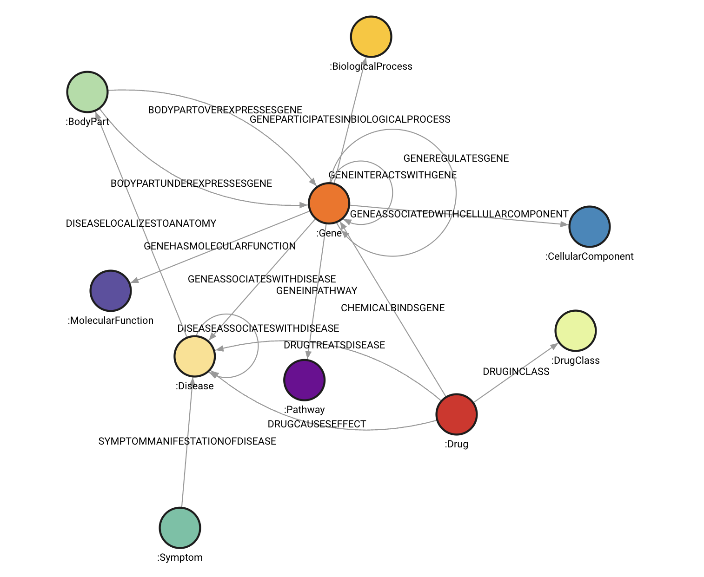

# AddictionKB
A knowledge base for AI research in addiction and HIV, based on graph databases. 



## Prerequisites
- Memgraph Lab (Desktop application)
    - Memgraph is used as the knowledge graph server in AddictionKB.
    - Memgraph offers a variety of [installation options](https://memgraph.com/docs/getting-started/install-memgraph).
    - Memgraph Lab is the easiest way to get up and running with AddictionKB. But you may use Memgraph Server if your deployment requires it.
- Python (version 3.7 or later)

## Installation

To build a copy of AddictionKB graph database, you can either:
- Download a copy of the latest CYPHERL file and import it into Memgraph
- Build the knowledge base from its original third-party sources and import it into Memgraph

### Install from CYPHERL file (easy)
- Visit the [Releases page](https://github.com/EpistasisLab/AddictionKB/releases) and find the version of AddictionKB you want to install. Unless you have a particular reason to do otherwise, this should probably be the most recent release. Follow the link in the release notes to the corresponding database dump (it will redirect to an external page).
- Using Memgraph Lab, import the downloaded CYPHERL file by navigating to _Import & Export_ and then click the _Import Data_ button.
    - For other ways to import the CYPHERL file into a Memgraph server, see [here](https://memgraph.com/docs/data-migration/cypherl)
- In Memgraph Lab, navigate to _Query execution_ to start querying the knowledge graph.

### Build from scratch (less easy)

**For detailed instructions on building AddictionKB from scratch, see the [Alzheimer's Disease Knowledge Base (AlzKB)](https://github.com/EpistasisLab/AlzKB) [here](https://github.com/EpistasisLab/AlzKB/blob/master/BUILD.org)**

Start by installing the Python package, which includes the necessary scripts:

```{bash}
$ git clone https://github.com/EpistasisLab/AddictionKB
$ cd AddictionKB
$ pip install .
```

#### Download the third-party database sources

First, install MySQL and make sure it is running, as some of the source
databases are only available as MySQL dumps.

We've created a script that will fetch all of the source files and put them into
the expected directory structure. We will try to keep this script as updated as
possible, but if you encounter any issues we suggest looking at the script and
making sure it points to entities that still exist.

```{bash}
$ addictionkb bootstrap
```

#### Populate the ontology

We use the external `ista` library to populate the OWL ontology. This should
be pretty much entirely automated:

```{bash}
$ addictionkb build
```

#### Load the ontology contents into Memgraph

This script will import the OWL 2 ontology contents into an empty Memgraph database
and clean up unnecessary artifacts left over by the OWL 2 standard:

```{bash}
$ addictionkb install
```

After this, check the Memgraph database (which will now be turned on) and make sure
everything looks alright.